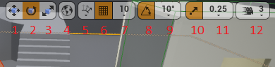

Viewport
========

Mouse
-----

Hold Left Mouse
^^^^^^^^^^^^^^^

 * Left and right to look around.
 * Forward and backwards to walk.

Hold Middle Button
^^^^^^^^^^^^^^^^^^

Panning.

Hold right Mouse
^^^^^^^^^^^^^^^^

 * Move mouse to look around
 * Use W, S, A, D to walk like a first person shooter game.
 * Use E and Q to move up and down respectively

Toolbar
-------

1. Translate
2. Rotate
3. Scale
4. Cycle coordinate system (world vs local)
5. Surface snapping option
6. Enable / disable snapping on translate
7. Translate snap value.
8. Enable / disable snapping on rotate 
9. Rotate snap value.
10. Enable / disable snapping on scale 
11. Scale snap value.
12. Camera speed for navigating.